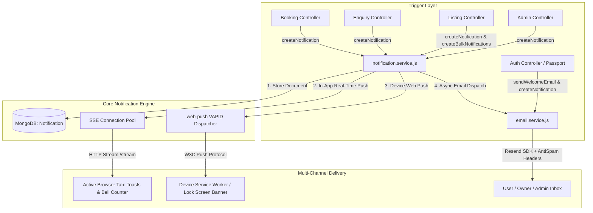

# RoofOnClick Notification & Email System Architecture

A unified, multi-channel notification engine for **RoofOnClick**. It delivers:
1. **Real-Time In-App Alerts** via **Server-Sent Events (SSE)** (zero polling delay).
2. **Persistent In-App Notification Center** stored in MongoDB.
3. **High-Deliverability Transactional Emails** directly via **Resend** (bypassing external n8n dependencies).
4. **Device-Level Web Push Notifications** via **W3C Push API & Service Workers** (Android, Windows, macOS lock-screen / notification tray alerts even when tab is closed).
5. **Anti-Spam Compliance** with true multipart MIME generation (HTML + plain-text fallback) and required headers.
6. **Full Multi-Role Support**: Seekers, Property Owners, and Platform Administrators.

---

## 🏗️ System Architecture

---

## 📱 1. Web Push Notifications (Lock-Screen / Device Alerts)

### How it Works:
1. The user clicks **"Enable"** on the *Get Lock-Screen Alerts* banner inside the notification dropdown.
2. The browser requests OS notification permissions and registers [public/sw.js](file:///c:/Users/adity/Documents/Roof%20On%20Click%20Docs/code-base/roof-on-click-ui/public/sw.js).
3. The client receives the server's **VAPID Public Key** (`/api/notifications/push/public-key`) and creates a `PushSubscription`.
4. The subscription endpoint and auth keys are saved in MongoDB ([PushSubscription.model.js](file:///c:/Users/adity/Documents/Roof%20On%20Click%20Docs/code-base/roof-on-click-server/backend/src/models/PushSubscription.model.js)).
5. When a notification is generated, `sendWebPushNotification` signs the payload using VAPID and sends it to the device gateway (Google FCM, Apple APNs, Mozilla Push).
6. The service worker displays a native system banner with sound and direct click-through action.

---

## 👥 2. Multi-Role Event Matrix

| Event Type | Trigger | Recipients | In-App SSE Push | Device Web Push | Transactional Email |
| :--- | :--- | :--- | :---: | :---: | :---: |
| **`auth.welcome`** | New user signup (Email or Google OAuth) | New User / Owner | ✅ | ✅ | ✅ |
| **`property.submitted`** | Owner creates new property listing | Property Owner | ✅ | ✅ | ✅ |
| **`property.review_needed`** | Owner creates new property listing | All Admins (`role: 'admin'`) | ✅ | ✅ | ✅ |
| **`property.approved`** | Admin approves listing | Property Owner | ✅ | ✅ | ✅ |
| **`property.rejected`** | Admin rejects listing | Property Owner | ✅ | ✅ | ✅ |
| **`property.suspended`** | Admin suspends listing | Property Owner | ✅ | ✅ | ✅ |
| **`property.deleted`** | Admin deletes listing | Property Owner | ✅ | ✅ | ✅ |
| **`booking.created`** | Seeker reserves booking | Property Owner | ✅ | ✅ | ✅ |
| **`booking.submitted`** | Seeker reserves booking | Seeker / Tenant | ✅ | ✅ | ✅ |
| **`booking.confirmed`** | Owner accepts reservation | Seeker / Tenant | ✅ | ✅ | ✅ |
| **`booking.cancelled`** | Booking cancelled | Owner & Seeker | ✅ | ✅ | ✅ |
| **`enquiry.created`** | Visitor sends enquiry/visit request | Property Owner | ✅ | ✅ | ✅ |
| **`enquiry.submitted`** | Visitor sends enquiry/visit request | Seeker / Visitor | ✅ | ✅ | ✅ |
| **`auth.password_reset`** | User requests password reset | User | — | — | ✅ |
| **`auth.oauth_notice`** | Google user tries password reset | User | — | — | ✅ |

---

## 🛡️ 3. Anti-Spam & Deliverability Safeguards

To prevent emails from landing in spam folders (Gmail, Outlook, Yahoo), the service enforces:

1. **True Multipart MIME Payload**:
   - Every email generates a responsive **HTML document** + a matching **Plain-Text alternative (`text`)**.
2. **Deliverability Headers**:
   - `List-Unsubscribe: <mailto:notifications@roofonclick.com?subject=unsubscribe>`
   - `X-Mailer: RoofOnClick Notification Mailer v1.0`
   - `Precedence: bulk` / `transactional`
3. **DNS Authentication (Required on Domain)**:
   - **SPF**: `v=spf1 include:resend.com ~all`
   - **DKIM**: `resend._domainkey` -> `dkim.resend.com`
   - **DMARC**: `_dmarc` -> `v=DMARC1; p=none; sp=none; pct=100;`

---

## 🔌 4. API Endpoints Reference

All routes are mounted at `/api/notifications` in [src/routes/notification.routes.js](file:///c:/Users/adity/Documents/Roof%20On%20Click%20Docs/code-base/roof-on-click-server/backend/src/routes/notification.routes.js):

| Method | Endpoint | Description |
| :--- | :--- | :--- |
| `GET` | `/api/notifications/stream` | Open real-time SSE push stream |
| `GET` | `/api/notifications/push/public-key` | Fetch VAPID public key for Web Push |
| `POST` | `/api/notifications/push/subscribe` | Register a device PushSubscription |
| `POST` | `/api/notifications/push/unsubscribe` | Unregister a device PushSubscription |
| `GET` | `/api/notifications` | Paginated notification list (`page`, `limit`, `category`, `isRead`) |
| `GET` | `/api/notifications/unread-count` | Quick unread badge count |
| `PUT` | `/api/notifications/:id/read` | Mark single notification as read |
| `PUT` | `/api/notifications/read-all` | Mark all notifications as read |
| `DELETE`| `/api/notifications/:id` | Delete single notification |
| `DELETE`| `/api/notifications` | Clear all notifications |
